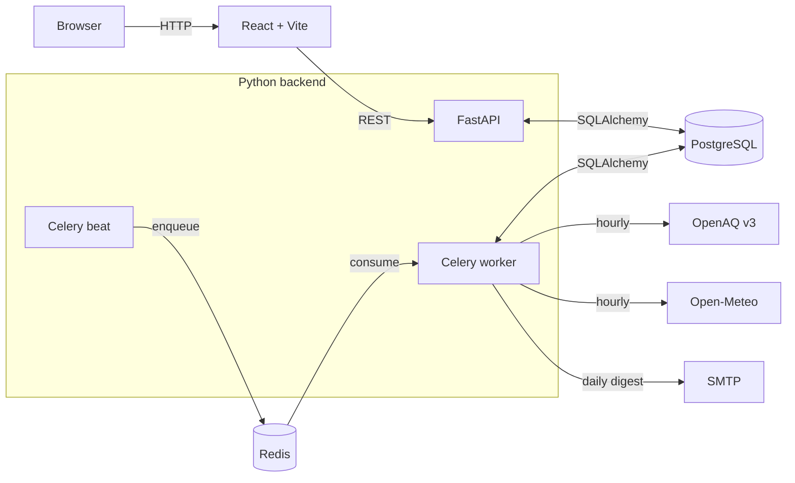

# AirWatch

> Production-style air quality monitoring platform. Hourly PM2.5 from OpenAQ
> merged with Open-Meteo weather, aggregated nightly into a leaderboard,
> with email alerts when subscribed locations cross a PM2.5 threshold.

[](https://github.com/vaishk1804/airwatch/actions/workflows/api-ci.yml)
[](https://github.com/vaishk1804/airwatch/actions/workflows/web-ci.yml)


---

## What it does

- **Ingests** hourly PM2.5 from OpenAQ v3 (with Open-Meteo air-quality as fallback) and hourly weather from Open-Meteo for every configured location
- **Aggregates** the hourly stream into daily metrics (`pm25_avg`, `pm25_max`, `bad_hours`, `bad_day`) on a Celery schedule
- **Serves** per-location dashboards (PM2.5 + weather time series, correlation analysis) and an executive summary with a bad-air-days leaderboard
- **Alerts** subscribers by email when their location has a "bad day"

## Architecture



Three processes off the same Docker image: `api`, `worker`, `beat`. Read
[`docs/ARCHITECTURE.md`](./docs/ARCHITECTURE.md) for the data model, request
flow, and job schedule.

## Stack

| Layer        | What's in it                                                    |
| ------------ | --------------------------------------------------------------- |
| Frontend     | React 19, TypeScript, Vite, TanStack Query, Recharts            |
| API          | FastAPI, Pydantic v2, uvicorn                                   |
| Async work   | Celery worker + beat, Redis broker                              |
| Data         | PostgreSQL 16, SQLAlchemy 2 (typed mappers), Alembic migrations |
| External     | OpenAQ v3, Open-Meteo (forecast + air-quality)                  |
| Infra        | Docker Compose for local, Render blueprint for deploy           |
| Quality      | pytest (27 tests), ruff, GitHub Actions, async load test        |

## Quickstart

```bash
# 1. Bring up Postgres, Redis, API, worker, and beat
make up

# 2. Apply migrations and seed locations
make migrate
make seed

# 3. Trigger the first ingest run (otherwise dashboards are empty)
make ingest

# 4. Run the frontend
cd apps/web && npm install && npm run dev
# → http://localhost:5173
```

Required env vars are documented in [`.env.example`](./.env.example). Only
`DATABASE_URL` and `REDIS_URL` are required to start; `OPENAQ_API_KEY` and
SMTP creds are optional.

## Project layout

```
.
├── apps/
│   ├── api/                    # FastAPI + Celery
│   │   ├── app/
│   │   │   ├── api/            # HTTP route handlers
│   │   │   ├── clients/        # OpenAQ + Open-Meteo HTTP clients
│   │   │   ├── core/           # Settings (pydantic-settings)
│   │   │   ├── db/             # Engine, Base, session
│   │   │   ├── jobs/           # Long-running pipeline jobs
│   │   │   ├── models/         # SQLAlchemy ORM models
│   │   │   ├── repositories/   # Pure SQL access functions
│   │   │   ├── services/       # Pure-Python domain logic
│   │   │   ├── scripts/        # CLI: migrate, seed, loadtest
│   │   │   ├── tasks.py        # Celery task definitions
│   │   │   ├── worker.py       # Celery app + beat schedule
│   │   │   └── main.py         # FastAPI entrypoint
│   │   ├── alembic/            # DB migrations
│   │   └── tests/              # pytest (unit + integration)
│   └── web/                    # React + Vite + TypeScript
│       └── src/
│           ├── components/     # KPI, charts, scatter plot
│           ├── lib/api.ts      # Typed API client
│           ├── pages/          # Home, LocationDashboard, Summary, Subscriptions
│           └── types/
├── docs/
│   ├── ARCHITECTURE.md
│   └── LOAD_TEST_RESULTS.md
├── infra/
│   └── docker-compose.yml
├── .github/workflows/          # API CI, Web CI
├── Makefile                    # `make help` for all targets
└── render.yaml                 # Render blueprint
```

## Design choices worth flagging

**Dashboard reads stay in Postgres.** The first cut of `/dashboard/location/{id}`
called Open-Meteo synchronously. Under 50 concurrent clients that produced
**63 RPS with a 74% error rate** because Open-Meteo rate-limited and 403s
propagated as 500s. Moving weather reads to a Celery-populated `weather_hourly`
table got it to **230 RPS at 0% errors** ([numbers](./docs/LOAD_TEST_RESULTS.md)).
The cold-start path falls back to a one-shot live fetch so a fresh deploy
isn't blank.

**Idempotent ingest.** Both `aq_measurements` and `weather_hourly` have unique
constraints on `(location_id, timestamp_utc, ...)` and the writer uses
Postgres `INSERT ... ON CONFLICT DO NOTHING`. Re-running an ingest never
double-counts.

**Typed mappers.** All models use SQLAlchemy 2's `Mapped[T]` syntax. The web
layer mirrors that with TypeScript types matched to the JSON shape, so
breaking changes show up at compile time.

**No tasks-in-API.** The HTTP layer never enqueues from a synchronous code
path. `/admin/alerts/send` returns a task ID; the worker does the work.

## Quality gates

```bash
make check        # ruff + pytest + tsc -b
```

| Gate           | Tool             | Where                                          |
| -------------- | ---------------- | ---------------------------------------------- |
| Lint           | ruff             | `pyproject.toml` config, runs in `api-ci.yml`  |
| Unit tests     | pytest           | 27 tests across services, normalizers, API     |
| Integration    | TestClient + SQLite | Real route handlers, real DB constraints   |
| Type-check     | `tsc -b`         | Runs in `web-ci.yml`                           |
| Docker build   | `docker build`   | Runs in `api-ci.yml`                           |
| Load test      | httpx + asyncio  | `make loadtest`, ad-hoc                        |

## Load test snapshot

```
$ make loadtest
Concurrency: 50  | Requests: 1000 | Wall: 5.04s | Throughput: 198 req/s
p50 = 124ms   p95 = 418ms   p99 = 1167ms   errors: 0
```

Pushed harder:

```
$ make loadtest C=100 N=50
Concurrency: 100 | Requests: 5000 | Wall: 21.72s | Throughput: 230 req/s
p50 = 255ms   p95 = 736ms   p99 = 1603ms   errors: 0
```

Single-process uvicorn, SQLite. Full numbers and method in
[`docs/LOAD_TEST_RESULTS.md`](./docs/LOAD_TEST_RESULTS.md).

## Roadmap

- Postgres-backed cache for OpenAQ sensor lookups (currently in-memory dict, lost on restart)
- WebSocket push for live PM2.5 updates instead of polling
- AQI conversion (currently raw µg/m³)
- OpenTelemetry traces for the ingest pipeline
- Backfill CLI for historical reanalysis windows

## License

MIT
