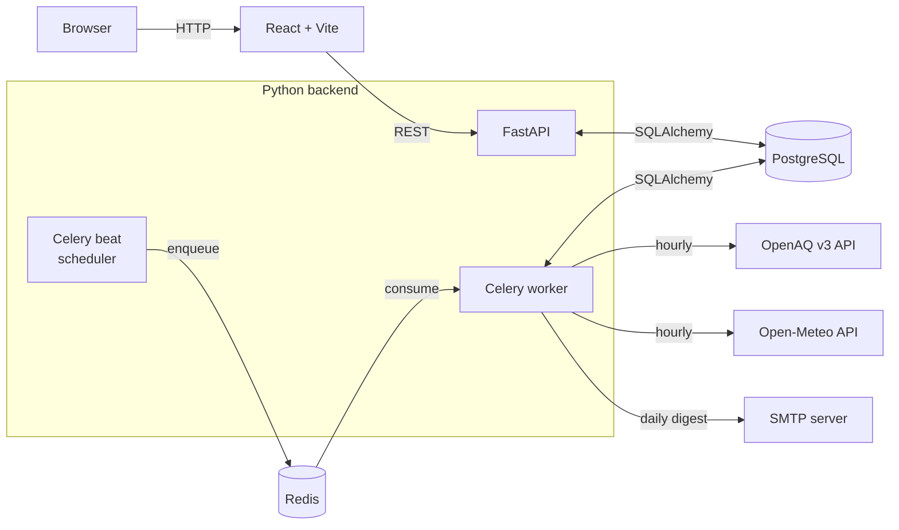
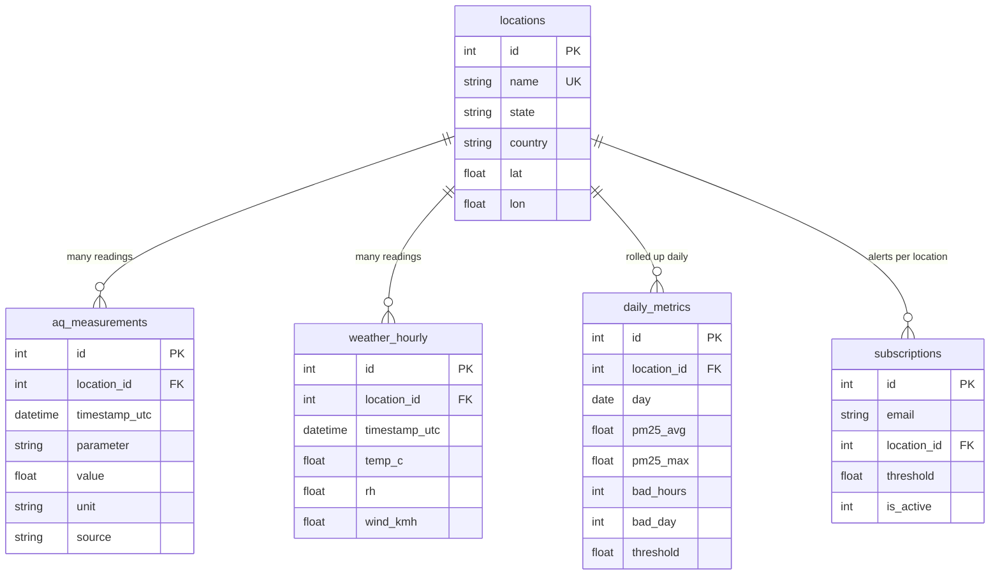
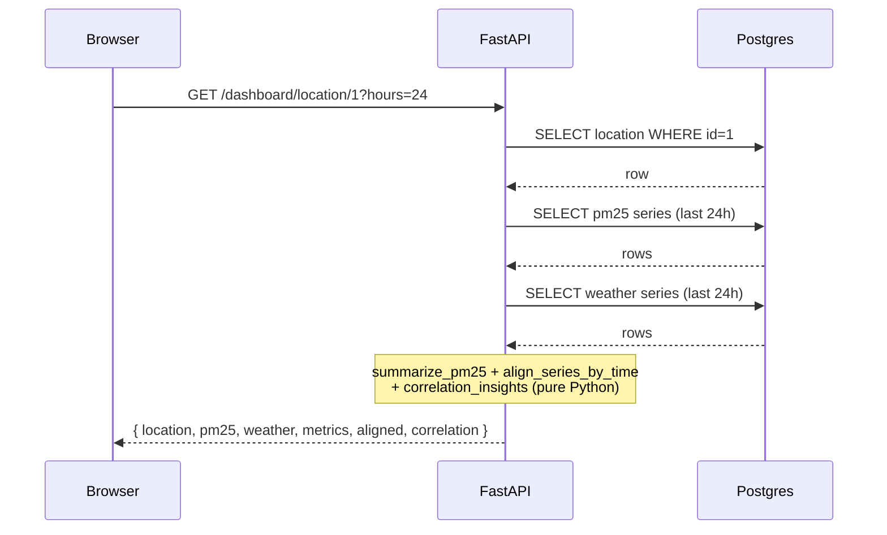

# AirWatch architecture

## At a glance

AirWatch is a small monorepo with three runtime processes (API, worker, beat),
a Postgres database, and a Redis broker. The data flow is **ingest → aggregate
→ serve → alert**:

1. **Beat** schedules ingest jobs every hour
2. **Worker** runs the jobs: it fetches hourly PM2.5 from OpenAQ (with Open-Meteo
   air-quality as a fallback) and hourly weather from Open-Meteo, then upserts
   into Postgres
3. Once a day, **worker** aggregates the hourly readings into `daily_metrics`
   (avg / max / bad_hours / bad_day) and runs the alert job, which emails any
   subscription whose location had a "bad day"
4. **API** serves the React dashboard out of the DB — no third-party calls in
   the request path (see [LOAD_TEST_RESULTS.md](./LOAD_TEST_RESULTS.md) for why)

## Component diagram

## Data model

Indexes that matter for hot paths:

| Table              | Index                                                  | Hot read                                       |
| ------------------ | ------------------------------------------------------ | ---------------------------------------------- |
| `aq_measurements`  | `(location_id, timestamp_utc)`                         | Dashboard PM2.5 time series                    |
| `aq_measurements`  | `unique (location_id, timestamp_utc, parameter, source)` | Idempotent upsert (`ON CONFLICT DO NOTHING`) |
| `weather_hourly`   | `(location_id, timestamp_utc)`                         | Dashboard weather time series                  |
| `daily_metrics`    | `(location_id, day)`                                   | Summary leaderboard + trend                    |
| `subscriptions`    | `unique (email, location_id)`                          | Idempotent subscription upsert                 |

## Job schedule

| Task                       | Cadence  | What it does                                                                                  |
| -------------------------- | -------- | --------------------------------------------------------------------------------------------- |
| `ingest_air_task`          | hourly   | Pull hourly PM2.5 for every location. OpenAQ first; Open-Meteo air-quality if OpenAQ has nothing in radius. |
| `ingest_weather_task`      | hourly   | Pull hourly temp/RH/wind from Open-Meteo                                                      |
| `aggregate_daily_task`     | every 6h | Group hourlies by day, compute `pm25_avg`, `pm25_max`, `bad_hours`, `bad_day`                 |
| `send_alerts_task`         | daily    | Email any subscription whose location had a `bad_day` yesterday                               |

All four are wired in `app/worker.py:beat_schedule`. The worker has automatic
exponential backoff (`autoretry_for=(Exception,)`, `retry_backoff=True`,
`max_retries=3`) for the two ingest tasks since upstream APIs are flaky.

## Request flow: `GET /dashboard/location/{id}`

Note: no outbound HTTP from the API in the steady state. Cold-start (empty
`weather_hourly`) is the one path where the API calls Open-Meteo, and only
for weather, never blocking the PM2.5 chart.

## Deployment shape

`render.yaml` declares three services off the same Docker image (`apps/api/Dockerfile`):

- `airwatch-api` — uvicorn, runs `python app/scripts/migrate.py && uvicorn app.main:app`
- `airwatch-worker` — `celery -A app.worker.celery_app worker`
- `airwatch-beat` — `celery -A app.worker.celery_app beat`

Locally, `infra/docker-compose.yml` runs all three plus Postgres and Redis.
The frontend deploys separately as a Vite static build.
